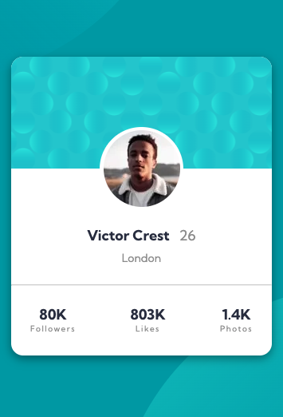

# Profile Card Component - Frontend Mentor Challenge

This project is a responsive **profile card component** based on a mockup from [Frontend Mentor](https://www.frontendmentor.io/challenges/profile-card-component-cfArpWshJ). Reimagined and built by **Elizabeth Parnell**, this implementation showcases modern web development practices using **Next.js**, **React**, **TypeScript**, and **CSS Modules**.

---

## 🖥️ Live Demo

- 🔗 [Live Site](https://bp-profile-card-component.netlify.app/)
- 💻 [Code Repository](https://www.frontendmentor.io/challenges/profile-card-component-cfArpWshJ)

---

## 🧰 Tech Stack

- **Next.js** – React framework for optimized rendering
- **React** – Modular component architecture
- **TypeScript** – Type safety for more maintainable code
- **CSS Modules** – Locally scoped styles
- **Mobile-first design** – Built to perform seamlessly across screen sizes

---

## 📸 Preview




---

## 📐 Features

- Fully responsive layout optimized for mobile and desktop
- Clean, modern styling consistent with the design mockup
- Semantic HTML and accessible structure
- Reusable component structure with separation of concerns

---

## 💡 Highlights & Learnings

One of the most satisfying aspects of this build was getting the background design elements positioned *just right*. I wanted to preserve a clean DOM and avoid using unnecessary `<div>`s purely for styling, so I turned to `::before` and `::after` pseudo-elements.

These allowed me to place the decorative top and bottom background images directly on the `body` element. They don't affect accessibility (since they're ignored by screen readers), and they adapt cleanly between mobile and desktop via media queries. It's a tiny technique that made a big difference in both layout clarity and code quality.

---

## ✅ What I’m Most Proud Of

I'm especially proud of using pseudo-elements to render the background images without cluttering the DOM. Instead of falling back on extra markup or stuffing styling concerns into components, I kept layout responsibilities where they belong—in the stylesheet. It's a subtle choice, but one that reflects a deeper commitment to writing clean, accessible, and maintainable code.

---

## 🚧 Areas for Future Iteration

- Add animations or transitions to the card on hover or mount
- Convert static content into dynamic props for scalabi

## 📚 Resources & Credits

- [Frontend Mentor Challenge](https://www.frontendmentor.io/challenges/profile-card-component-cfArpWshJ) – Original mockup and layout specs
- [CSS Tricks - A Complete Guide to Grid](https://css-tricks.com/snippets/css/complete-guide-grid/)
- [MDN Web Docs](https://developer.mozilla.org/en-US/) – Reference for web standards

---

## 👩‍💻 About the Developer

**Elizabeth Parnell**  
Software Engineer | Frontend Specialist | UX Enthusiast

- 🌐 [Portfolio](https://eparnell.me)
- 🧑‍💼 [LinkedIn](https://www.linkedin.com/in/elizabethjparnell/)
- 💻 [GitHub](https://github.com/ejparnell)
- 📝 [Frontend Mentor Profile](https://www.frontendmentor.io/profile/ejparnell)

---

## 🏁 Getting Started Locally

To run this project locally:

```bash
git clone https://github.com/ejparnell/profile-card-component.git
cd profile-card-component
npm install
npm run dev
```

Then open your browser and navigate to `http://localhost:3000`.

## 📜 License

This project is open-source and available under the [MIT License](https://opensource.org/license/mit/). Original design and assets are property of [Frontend Mentor](https://www.frontendmentor.io/).
